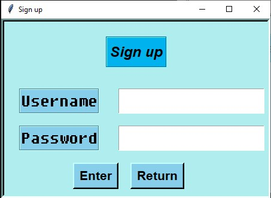

## Table of contents
* [General info](#general-info)
* [Components](#components)
* [Setup](#setup)
* [Windows](#windows)
* [Conclusion](#conclusion)

## General info
This project is a simple gui script that allows a user to register an account or login
	
## Components
This project is created with:
* MySQL 8.0
* Python 3 (with tkinter for GUI)
	
## Setup
To run this project, you will first need MySQL DB setup in following hierarchy:
* <database_name>
  - user
    - username 
    - password  

You can do this by entering the following commands in MySQL Command Line Client
```
CREATE DATABASE <database_name>;
CREATE TABLE user (username varchar(20), password varchar(20))
```
Now download the main.py file and replace the database variable to whatever 
you named your database on line 60 and l06. Ensure that the database is online and then run the script

## Windows




## Conclusion

In conclusion, I had a lot of fun making this project. I overcame many problems and learnt many things. Feel free to tweak it and let me know what you think of it.
